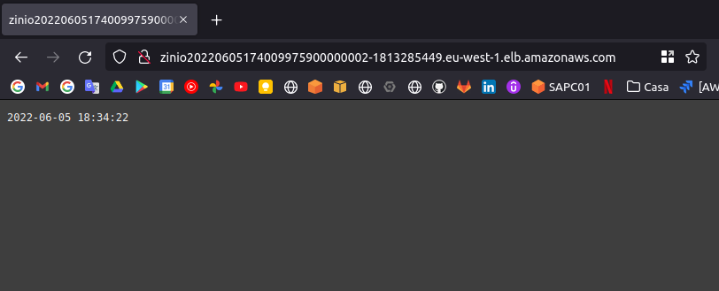

# Devops test

Giving the following microservice, add the necessary files to:

* Provision the infrastructure to run the service in a public cloud (AWS preferred)
* Build / Deploy the infrastructure and the service (CI/CD)

This may include but not limited to:

* IaC files (terraform, cloudformation,...)
* pipeline files 

Feel free to use any open-source / 3rd party system that you consider necessary.

The purpose of this is to evaluate:

* Ability to code IaC
* Understanding of Cloud / Container platforms
* Understanding of CI/CD tools
* Devops perspective (scalability, reliability, security, cost)

# Implementation details

* The cloud provider is AWS. All resources would be deployed in the eu-west-1 region
* The IAC tool used is Terraform
* The pipeline is base on Gitlab pipeline

## Infrastructure

The infrastructure code is located in the [terraform](terraform) folder.

The following asumptions are made regarding the AWS account:

1. A single account strategy is used in the organization (as this is what I have available to test with).
2. A VPC will be created as part of the excercise. This might not be a valid approach for all settings.
3. No effort is made to harden the networking infrastructure beyond the use of simple Security group, as this is beyond the scope of the excercise. namely no advenced security feature (Network firewall, Security hub, VPC flowlogs, etc) are used.
4. IAM: we use an IAM user in order to create the infrastructure. Note that in a real context, that is not the best way to proceed.
5. The terraform code is split into local modules.
6. The DB backend has been replaced by a single RDS instance to save on cost but provide a higher resiliency target than a container. An RDS cluster should be considered for production environment

### How to deploy

Follow these steps to setup the infrastructure:

1. Create an IAM user with Admin priviledges (IAM roles out of scope).
2. Launch the terraform in the [bootstrap](terraform/bootstrap/) directory to create the resources required by terraform to keep its state in a CICD context
3. Launch the terraform in the [eu-west-1](terraform/eu-west-1/) directory to create the infrastructure resources.
4. Once the infrastructure has been created you must create the first version of the image and upload it to your ECR repository following these commands (beware the `account_id` must be changed to the account you deployed the infrastructure to)

```shell
?> cd api/
?> docker build --rm --tag <account_id>.dkr.ecr.eu-west-1.amazonaws.com/ziniollc-devops-test-62f1178138d1:latest .
?> aws --profile ziniollc-devops-test-62f1178138d1 ecr get-login-password --region eu-west-1 | \
    docker login --username AWS --password-stdin <account_id>.dkr.ecr.eu-west-1.amazonaws.com
?> docker push <account_id>.dkr.ecr.eu-west-1.amazonaws.com/ziniollc-devops-test-62f1178138d1:latest
```

5. Once the first version has been uploaded you can force a new deploymemt in ECS

## CICD

The pipeline is created using Gitlab CICD. However a similar pipeline could created using Jenkins, or CodeBuild, or whichever tool is used internally.
The code is located in the file [.gitlab-ci.yml](.gitlab-ci.yml). It is an extremely simple pipeline that is composed of 3 steps:
1. Build the Docker image locally
2. Upload the built image to the ECR repository
3. Deploy the docker image to the ECS Cluster

It is a basic pipeline that has a certain number of restrictions such as for instance the fact that it does not provide different behavior according to branches on which the commit happen. It could be easily improved upon to implement such behavior. It also points to only one ECS cluster. In a multi branch context, one might want to point to different cluster such as development and production cluster.

# Evidences

* Swoole server running



# Improvments

1. The loadbalancer should provide HTTPS listener, once a domain is available and an ACM certificate has been created
2. Update the container which has been detected to be vulnerable to these critical CVE
* CVE-2019-19816
* CVE-2019-10220
* CVE-2019-14901
* CVE-2019-15505
* CVE-2019-19814
* CVE-2019-14896
* CVE-2022-0435
* CVE-2021-3973


